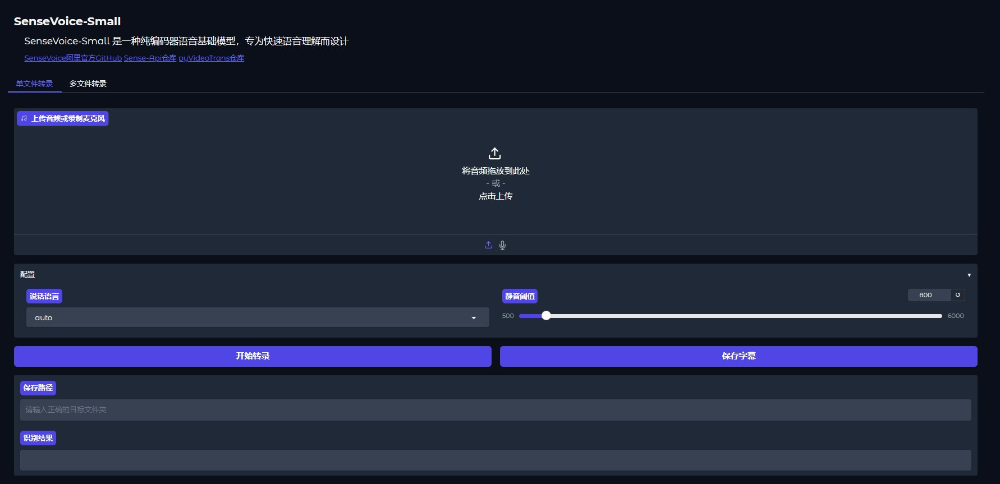

[中文](README_ZH.md) | [English](README.md)

Based on the official SenseVoice WebUI, modified to support single-file or batch output of SRT subtitles. 

Environment Setup:

1, Create a virtual environment using uv: such as ```uv venv --python 3.12```

2, Install dependencies using the following command: ```uv pip install -r requirements``` or ```uv add -r requirements```

3, For **CUDA** transcription, install torch and torchaudio: https://pytorch.org/get-started/locally/, such as: ```uv pip install torch torchaudio --index-url https://download.pytorch.org/whl/cu126```

4, For **CPU** transcription, install torch and torchaudio: ```uv pip install torch torchaudio --index-url https://download.pytorch.org/whl/cpu```

5, Model download instructions:

Modify the model loading parameters for ```sensevoicesmall``` and ```fmsn_vad```.
When ```disable_update=False```, the models will be automatically downloaded.
After downloading, set ```disable_update=True``` to reduce startup time.


**Important**:
When performing batch transcription, always test with a single file first to find the optimal silence threshold and ensure accurate sentence segmentation.

