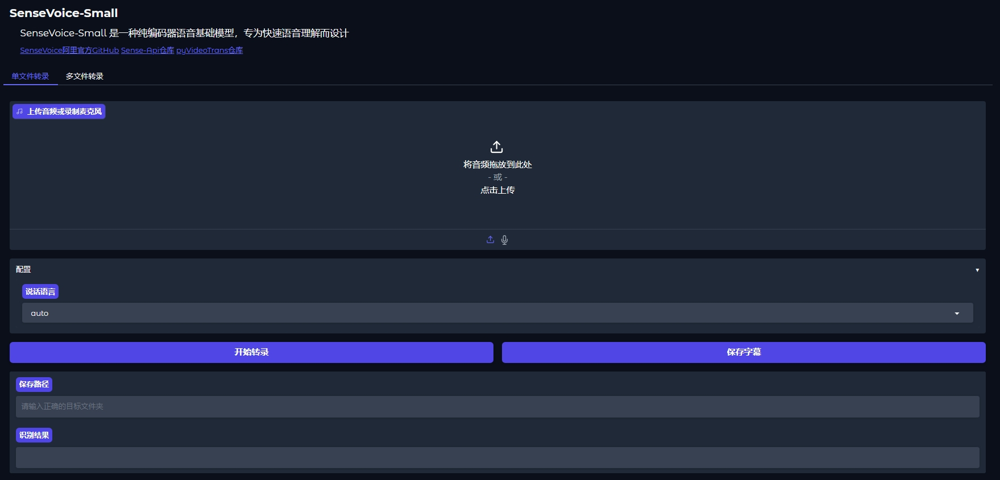

# SenseVoice-SRT

简体中文：
基于[sensevoice](https://github.com/FunAudioLLM/SenseVoice)官方webui修改而来，可以单文件或批量输出SRT字幕。需要配合官方项目使用。

English:
Based on the official [sensevoice](https://github.com/FunAudioLLM/SenseVoice) webui, it can output SRT subtitles for single files or in batch mode. It needs to be used in conjunction with the official project.

日本語:
これは[sensevoice](https://github.com/FunAudioLLM/SenseVoice)の公式webuiを基にしたものです。単一ファイルまたはバッチ処理でSRT字幕を出力できます。これは公式プロジェクトと併せて使用する必要があります。

